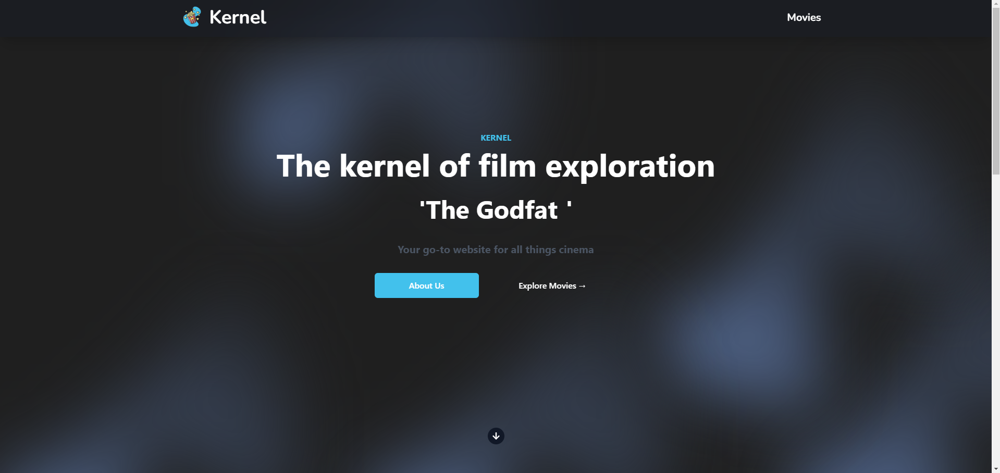
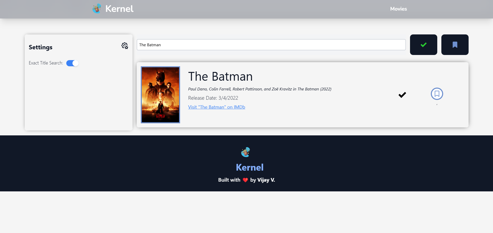
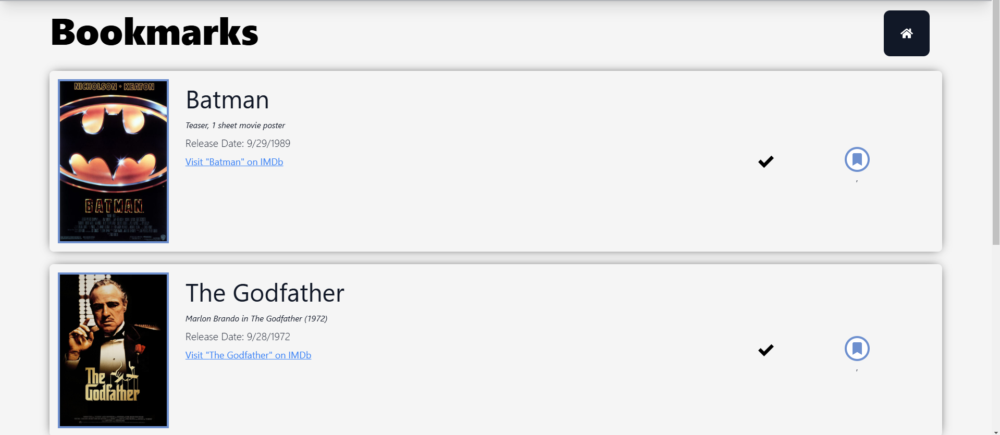
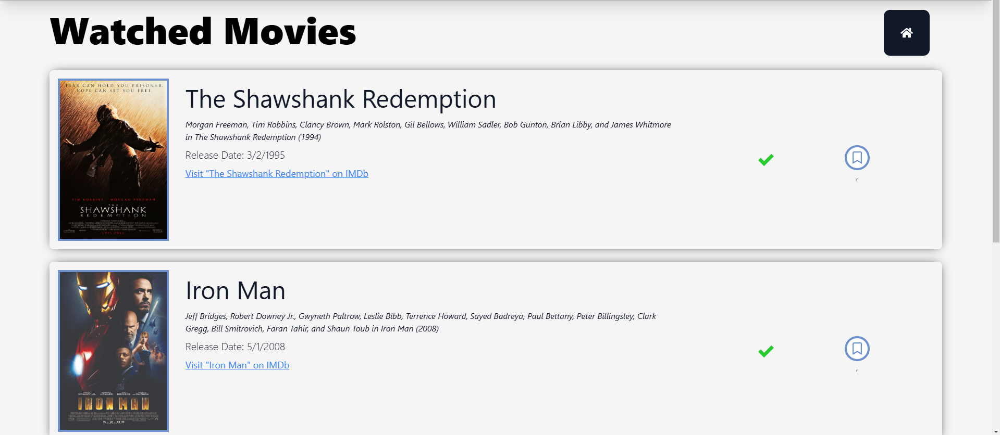

# Kernel

Kernel is a website developed in React JS that leverages the MoviesDatabase API. It allows users to bookmark movies to watch later, and save watched movies, saving this data in local storage.

## Screenshots

### Home Screen

### Movie Search

### Bookmarks Page

### Watched Page

